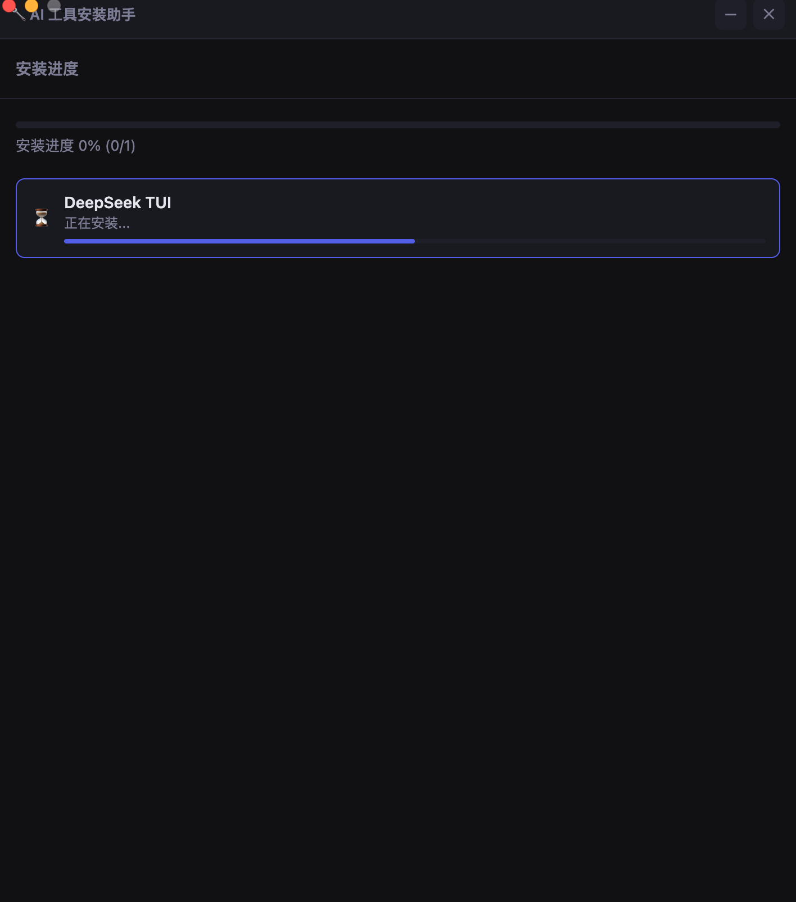

<div align="center">
  <h1>🔧 AI Tool Installer <sub>· AI 工具安装助手</sub></h1>
  <h3>One-Click Installer for AI Coding Tools</h3>
  <p>
    <em>Automatic environment detection · Dependency management · One-click installation<br>
    Supports Claude Code, Codex CLI, Cursor, DeepSeek TUI, Windsurf, Trae, and more</em>
  </p>
  <p>
    <a href="README.zh.md"></a>
    <a href="https://github.com/questionjie-max/ai-installer/releases"></a>
    <a href="https://github.com/questionjie-max/ai-installer/blob/main/LICENSE"></a>
    <a href="https://github.com/questionjie-max/ai-installer/issues"></a>
  </p>
  <!-- Screenshot Gallery: 2x2 Grid -->
  <p><strong>How it works — 4 simple steps</strong></p>
</div>

<table align="center">
<tr>
  <td align="center" width="280">
    <strong>① Welcome</strong><br>
    <br>
    <em>Launch the installer</em>
  </td>
  <td align="center" width="280">
    <strong>② Select Tools</strong><br>
    <br>
    <em>Choose AI coding tools</em>
  </td>
</tr>
<tr>
  <td align="center" width="280">
    <strong>③ Detect Environment</strong><br>
    <br>
    <em>Auto-check Node, Git & network</em>
  </td>
  <td align="center" width="280">
    <strong>④ Install</strong><br>
    <br>
    <em>One-click install, ready to use</em>
  </td>
</tr>
</table>

<div align="center">
</div>

---

## 📖 Overview

**AI Tool Installer** is a desktop GUI application that helps developers set up AI coding tools in minutes. Instead of visiting multiple websites, running scattered install commands, and manually configuring PATH — just select the tools you want and click install.

### Why this exists

Setting up AI coding tools like Claude Code, Cursor, or DeepSeek TUI typically requires:
1. Installing Node.js (checking versions, configuring PATH)
2. Installing Git
3. Running `npm install -g` commands
4. Manually linking binaries to PATH
5. Repeating for each tool

This installer automates the entire process — from environment detection to installation — especially optimized for users in China (mainland) where downloading from international sources can be slow.

---

## ✨ Features

| Feature | Description |
|---------|-------------|
| **🖥️ Desktop GUI** | No terminal commands needed — simple point-and-click interface |
| **🔍 Auto Detection** | Detects Node.js, Git, Python versions and network connectivity |
| **⚡ Smart Mirror** | Auto-switches to Chinese mirrors (npmmirror.com) when international sources are slow |
| **📦 One-Click Install** | Select multiple tools → detect → install, all in one flow |
| **🔗 PATH Auto-Link** | CLI binaries automatically linked to `~/.local/bin` — use immediately after install |
| **🌐 Cross-Platform** | macOS (Apple Silicon + Intel) and Windows support |

---

## 📦 Supported Products (14 tools)

### CLI / Terminal AI Agents
Tools that run in your terminal — perfect for automation and direct code manipulation.

| Product | Vendor | Install | Stars |
|---------|--------|---------|-------|
| [Claude Code](https://docs.anthropic.com/en/docs/claude-code/overview) | Anthropic | `npm i -g @anthropic-ai/claude-code` | — |
| [Codex CLI](https://github.com/openai/codex) | OpenAI | `npm i -g @openai/codex` | — |
| [OpenCode](https://github.com/sst/opencode) | SST / anomalyco | `npm i -g opencode-ai` | ⭐ 163k |
| [DeepSeek TUI](https://github.com/Hmbown/DeepSeek-TUI) | Hunter Bown | `npm i -g deepseek-tui` | ⭐ 33k |
| [Kimi Code](https://www.npmjs.com/package/kimi-code) | Moonshot AI | `npm i -g kimi-code` | — |
| [Qoder CLI](https://qoder.com) | Alibaba Cloud | `npm i -g @qoder-ai/qodercli` | — |
| [OpenClaw](https://github.com/openclaw/openclaw) | Open Source | `npm i -g openclaw` | — |
| [Hermes Agent](https://github.com/NousResearch/hermes-agent) | Nous Research | Install script | — |

### AI Code Editors
Desktop applications with built-in AI capabilities.

| Product | Vendor | Platform |
|---------|--------|----------|
| [Cursor](https://cursor.com) | Anysphere | macOS, Windows |
| [Windsurf](https://windsurf.com) | Codeium | macOS, Windows, Linux |
| [Trae](https://www.trae.com.cn) | ByteDance | macOS, Windows |
| [Qoder Desktop](https://qoder.com) | Alibaba Cloud | macOS, Windows, Linux |
| [VS Code](https://code.visualstudio.com) | Microsoft | macOS, Windows, Linux |

### Management Tools

| Product | Vendor | Description |
|---------|--------|-------------|
| [CC Switch](https://github.com/checherish56/cc-switch-app) | Open Source | Switch between and manage multiple AI coding assistants |

---

## 🚀 Quick Start

### Prerequisites
- **macOS**: 12.0+ (Apple Silicon or Intel)
- **Windows**: Windows 10+ (x64)

### Download
Get the latest installer from the [Releases page](https://github.com/questionjie-max/ai-installer/releases).

### Or run from source
```bash
git clone https://github.com/questionjie-max/ai-installer.git
cd ai-installer
npm install
npm start
```

### Usage Flow
```
1. Open app    →   2. Select tools    →   3. Detect environment    →   4. Click install    →   ✅ Done!
     ↓                    ↓                       ↓                           ↓
  Welcome screen      Check 14 tools         Auto-checks Node,         Automated npm install,
                     across 3 categories     Git & network status      PATH linking, downloads
```

---

## 🧩 Architecture

```
ai-installer/
├── main.js              # Electron main process — window management & IPC
├── preload.js           # Secure bridge between renderer and main process
├── products.json        # Configuration for all 14 supported products
├── modules/
│   ├── products.js      # Product config loader & dependency resolver
│   ├── detector.js      # Environment detection — Node, Git, network
│   └── installer.js     # Installation engine — npm, download, script
├── renderer/
│   ├── index.html       # 4-page UI (welcome, select, detect, install)
│   ├── css/style.css    # Dark theme, glassmorphism design
│   └── js/app.js        # Frontend interaction logic
├── docs/                # Documentation & screenshots
└── package.json         # Electron + electron-builder
```

Built with **Electron** — cross-platform desktop applications with web technologies.

---

## 🖥️ Building from Source

```bash
# Install dependencies
npm install

# Run in development mode
npm start

# Build for macOS
npm run build:mac

# Build for Windows (requires Wine on macOS)
npm run build:win
```

Output is in the `dist/` directory.

---

## 🌏 Network Optimization

For users **in mainland China**:

The installer automatically detects network conditions:
- **Fast international access** → uses official package sources (npmjs.org)
- **Slow or blocked** → auto-switches to [npmmirror.com](https://npmmirror.com) (Alibaba Cloud mirror)

No manual configuration or VPN required.

### Offline Cache
Pre-downloaded installers can be placed in the `cache/` directory for air-gapped environments.

---

## 📄 License

This project is [MIT](LICENSE) licensed.

---

## 🤝 Contributing

Contributions are welcome! Whether it's adding support for new AI tools, improving the UI, or fixing bugs:

1. Open an [issue](https://github.com/questionjie-max/ai-installer/issues) to discuss changes
2. Submit a [pull request](https://github.com/questionjie-max/ai-installer/pulls)
3. Star the repo ⭐ to help others discover it

---

<div align="center">
  <sub>Made for developers who just want to code with AI, not configure it.</sub>
  <br>
  <sub>Built with ❤️ for the open source community</sub>
</div>
