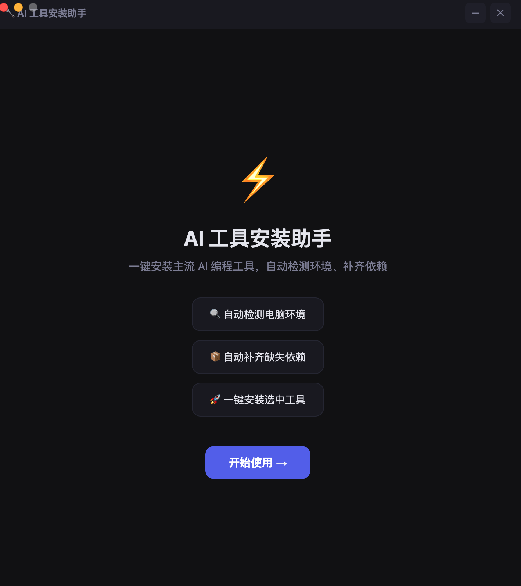
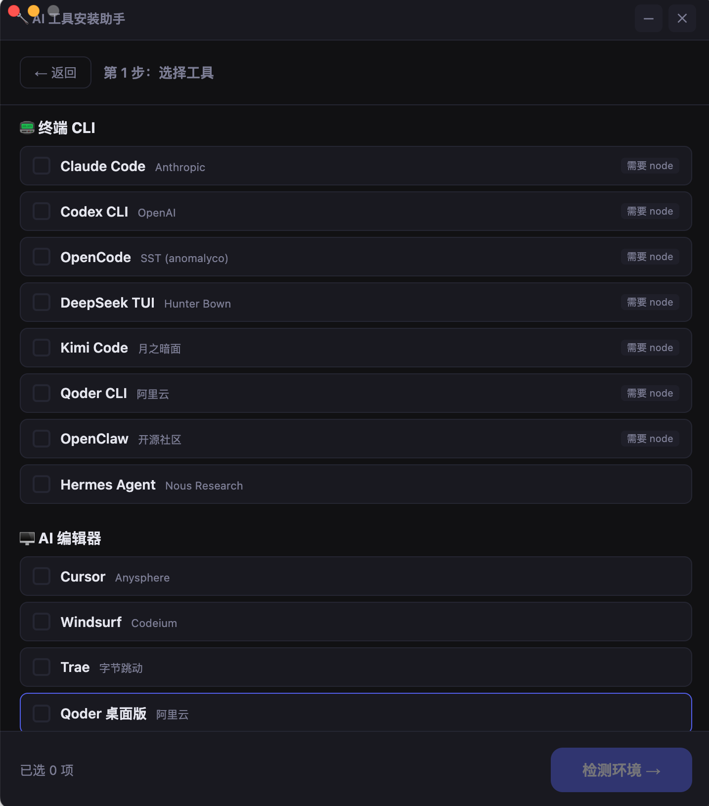
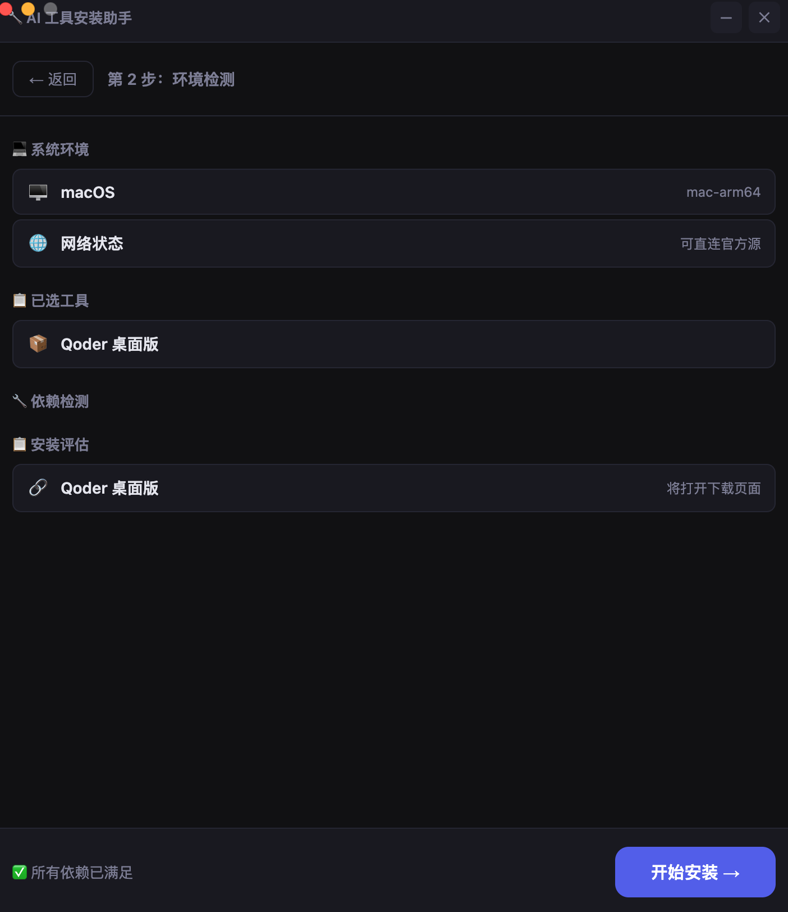

# AI Tool Installer — User Manual

## Overview

AI Tool Installer is a desktop application that helps developers quickly set up AI coding tools. It automates environment detection, dependency installation, and tool setup — so you can start coding with AI in minutes instead of hours.

---

## Installation

### System Requirements

- **macOS**: 12.0 (Monterey) or later (Apple Silicon / Intel)
- **Windows**: Windows 10 or later (x64)
- **Storage**: 200MB free for the installer + space for installed tools
- **Internet**: Required for downloading tools and dependencies

### Download

1. Go to the [Releases page](https://github.com/questionjie-max/ai-installer/releases)
2. Download the latest version for your platform:
   - macOS: `AI-Installer-x.x.x-mac-arm64.dmg` or `.zip`
   - Windows: `AI-Installer-x.x.x-win-x64.exe`

### Install

**macOS**: Open the `.dmg` file and drag the app to Applications folder. If you see a security warning, go to System Settings → Privacy & Security → click "Open Anyway".

**Windows**: Run the `.exe` installer and follow the prompts.

---

## Usage Guide

### Step 1: Welcome Screen

When you first open the app, you'll see the welcome screen with a brief introduction. Click **"开始使用 →"** (Get Started) to begin.



### Step 2: Select Tools

Browse the product catalog organized by category:
- **📟 CLI / Terminal Agents** — Command-line AI coding assistants
- **🖥️ AI Editors** — AI-powered code editors
- **🔄 Management Tools** — Utility tools for managing AI assistants

Check the boxes next to the tools you want to install. You can select multiple tools at once.



> **Tip**: Tools with unmet dependencies (e.g., requiring Node.js) can still be selected — the installer will automatically install the required dependencies first.

### Step 3: Environment Detection

After clicking **"检测环境 →"** (Detect Environment), the app will:
1. Check your operating system and architecture
2. Test network connectivity (direct or mirror)
3. Check each required dependency (Node.js, Git)
4. Evaluate which selected tools are ready to install

The results screen shows:
- ✅ **System info** — OS type and architecture
- 🌐 **Network status** — Direct connection or Chinese mirror
- ✅/❌ **Dependency checks** — What's installed and what's missing
- 📋 **Installation assessment** — Which tools are ready



### Step 4: Installation

Click **"开始安装 →"** (Start Install) to begin. The installer will:

1. Install any missing system dependencies (Node.js, Git)
2. Install each selected tool in sequence
3. Show real-time progress for each item

For CLI tools, the installer runs `npm install -g` and automatically links the binaries to `~/.local/bin/` so you can use them immediately in your terminal.

For desktop editors (Cursor, VS Code), the installer downloads the DMG/EXE and opens the installer for you.

For other editors (Windsurf, Trae, Qoder), the app opens their official download page.

### Step 5: Completion

When installation finishes, you'll see a summary of what was installed. CLI tools are ready to use — just type the command in your terminal.

---

## Network Notes

### For users in China

The installer automatically detects your network:
- If it can reach `registry.npmjs.org` directly → uses official sources
- If the official source is slow/unreachable → switches to `npmmirror.com` (Chinese mirror)

No manual configuration needed. No VPN required.

### Offline Installation

You can pre-download the installers and place them in the `cache/` directory:
```
cache/
├── node-v20.18.0-arm64.pkg
├── Git-2.45.1-arm64.dmg
└── ...
```
The installer will use cached files instead of downloading.

---

## Troubleshooting

| Problem | Solution |
|---------|----------|
| App won't open (macOS) | Go to System Settings → Privacy & Security → click "Open Anyway" |
| npm install is slow | The app auto-switches to mirror, or manually set `ELECTRON_MIRROR` env |
| Command not found after install | Run `hash -r` or restart your terminal. Check `~/.local/bin/` is in your PATH |
| Installation fails | Check the install log, retry failed items, or open an [issue](https://github.com/questionjie-max/ai-installer/issues) |

---

## Development

```bash
git clone https://github.com/questionjie-max/ai-installer.git
cd ai-installer
npm install
npm start        # Run in development mode
npm run build:mac  # Build macOS DMG
```

### Adding a New Product

Edit `products.json` and add an entry to the appropriate category:

```json
{
  "id": "your-tool",
  "name": "Your Tool",
  "vendor": "Your Company",
  "description": "Brief description",
  "installType": "npm",
  "packageName": "your-npm-package",
  "requires": ["node"],
  "platforms": ["mac", "win"]
}
```

---

## License

MIT
