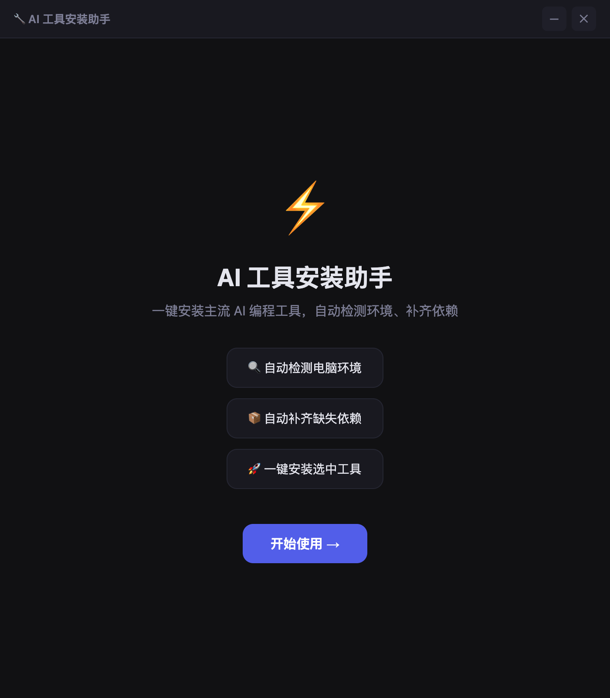

# AI 工具安装助手 — 用户手册

## 概述

AI 工具安装助手是一个桌面应用，帮助开发者快速配置 AI 编程工具。它自动检测环境、补齐依赖、安装工具——让你几分钟就能开始用 AI 编程，不需要自己手动折腾。

---

## 安装本工具

### 系统要求

- **macOS**: 12.0 或更高版本（Apple Silicon / Intel）
- **Windows**: Windows 10 或更高版本（x64）
- **存储**: 200MB 空闲（安装器本身）+ 安装工具所需空间
- **网络**: 需要网络下载工具和依赖

### 下载

1. 打开 [Releases 页面](https://github.com/questionjie-max/ai-installer/releases)
2. 下载对应平台的最新版本：
   - macOS: `AI-Installer-x.x.x-mac-arm64.dmg` 或 `.zip`
   - Windows: `AI-Installer-x.x.x-win-x64.exe`

### 安装本工具

**macOS**: 打开 `.dmg` 文件，把应用拖到「应用程序」文件夹。如果提示安全警告，去系统设置 → 隐私与安全性 → 点"仍要打开"。

**Windows**: 运行 `.exe` 安装程序，按提示完成安装。

---

## 使用指南

### 第一步：欢迎页

打开应用后看到欢迎页，点击 **"开始使用 →"** 进入下一步。



### 第二步：选择工具

浏览按分类整理的产品目录：
- **📟 终端 CLI** — 命令行 AI 编程助手
- **🖥️ AI 编辑器** — AI 驱动的代码编辑器
- **🔄 管理工具** — AI 编程助手管理工具

勾选你想安装的工具，可以一次选多个。


> **提示**：依赖不满足的工具（如需要 Node.js）也可以勾选——安装器会自动先补齐缺少的依赖。

### 第三步：环境检测

点击 **"检测环境 →"** 后，应用会自动：
1. 检测操作系统和架构
2. 测试网络连接（直连或镜像）
3. 检查每个需要的依赖（Node.js、Git）
4. 评估哪些选中的工具可以直接安装

结果页面显示：
- ✅ **系统信息** — OS 类型和架构
- 🌐 **网络状态** — 直连或国内镜像
- ✅/❌ **依赖检测** — 已安装和缺少的依赖
- 📋 **安装评估** — 各工具是否可安装


### 第四步：一键安装

点击 **"开始安装 →"** 开始安装。安装器会自动：

1. 安装缺失的系统依赖（Node.js、Git）
2. 按顺序安装每个选中的工具
3. 实时显示每个项目的进度

**CLI 工具**：安装器执行 `npm install -g`，然后自动把命令链接到 `~/.local/bin/`，终端直接就能用。

**桌面编辑器（Cursor、VS Code）**：下载 DMG/EXE 后自动打开安装器。

**其他编辑器（Windsurf、Trae、Qoder）**：打开官方下载页面。

### 第五步：完成

安装完成后显示结果汇总。CLI 工具装完就能用——直接在终端输入命令即可。

---

## 网络说明

### 中国大陆用户

安装器自动检测你的网络：
- 如果能直连 `registry.npmjs.org` → 走官方源
- 如果官方源慢/连不上 → 自动切到 `npmmirror.com`（淘宝镜像）

无需手动配置，不需要 VPN。

### 离线安装

可以把安装包提前下载好放到 `cache/` 目录：
```
cache/
├── node-v20.18.0-arm64.pkg
├── Git-2.45.1-arm64.dmg
└── ...
```
安装器会优先使用缓存文件，跳过下载。

---

## 常见问题

| 问题 | 解决方法 |
|------|---------|
| 打不开应用（macOS） | 系统设置 → 隐私与安全性 → 点"仍要打开" |
| npm 安装很慢 | 应用会自动切镜像，或者在环境变量中设置 `ELECTRON_MIRROR` |
| 装完找不到命令 | 在终端执行 `hash -r` 或重启终端。确认 `~/.local/bin/` 在 PATH 中 |
| 安装失败 | 查看安装日志，重试失败的项目，或提 [Issue](https://github.com/questionjie-max/ai-installer/issues) |

---

## 开发

```bash
git clone https://github.com/questionjie-max/ai-installer.git
cd ai-installer
npm install
npm start             # 开发模式运行
npm run build:mac     # 打包 macOS DMG
```

### 添加新产品

编辑 `products.json`，在对应分类中添加：

```json
{
  "id": "your-tool",
  "name": "你的工具",
  "vendor": "你的公司",
  "description": "简短描述",
  "installType": "npm",
  "packageName": "your-npm-package",
  "requires": ["node"],
  "platforms": ["mac", "win"]
}
```

---

## 开源协议

MIT
